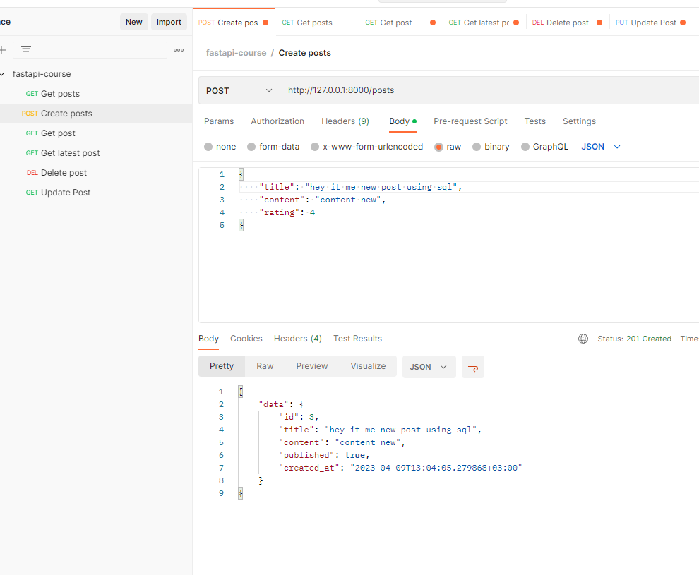

# Connect DB

```python
while True:
    try:
        conn = psycopg2.connect(host='localhost', database='db_fast_stupns_api', user='postgres', password='postgres',
                                cursor_factory=RealDictCursor)
        cursor = conn.cursor()
        print("Database connection was successfull!")
        break
    except Exception as error:
        print("Connection to database failed")
        print("Error: ", error)
        time.sleep(2)
```

## Start job with ORM:

```python
@app.get('/posts')
def get_posts():
    cursor.execute("""SELECT * FROM posts """)
    posts = cursor.fetchall()
    return {"data": posts}
```

and send request in get posts we can see next response:


___
### Create a posts using cursor:
```python
@app.post('/posts', status_code=status.HTTP_201_CREATED)
def create_posts(post: Post):
    cursor.execute("""INSERT INTO posts (title, content, published) VALUES (%s, %s, %s) RETURNING * """,
                   (post.title, post.content, post.published))
    new_post = cursor.fetchone()
    conn.commit()
    return {"data": new_post}
```

___
### Get a post using cursor:
```python 
@app.get("/posts/{id}")
def get_post(id: int):
    cursor.execute("""SELECT * from posts WHERE id = %s""", (str(id)))
    post = cursor.fetchone()
    if not post:
        raise HTTPException(status_code=status.HTTP_404_NOT_FOUND,
                            detail=f"post with id : {id} was not found")
    return {"post_detail": post}
```


___
### DELETE post using cursor

```python
@app.delete('/posts/{id}', status_code=status.HTTP_204_NO_CONTENT)
def delete_post(id: int):
    cursor.execute(""""DELETE FROM posts WHERE id = %s returning *""", (str(id)))
    deleted_post = cursor.fetchone()
    conn.commit()
    if deleted_post == None:
        raise HTTPException(status_code=status.HTTP_404_NOT_FOUND, detail=f"post with id : {id} does not exist")
    return Response(status_code=status.HTTP_204_NO_CONTENT)
```

___
### UPDATE post using cursor

```python
@app.put("/posts/{id}")
def update_post(id: int, post: Post):
    cursor.execute("""UPDATE posts SET title = %s, content = %s, published = %s  WHERE id = %s RETURNING *""",
                   (post.title, post.content, post.published, str(id)))
    updated_post = cursor.fetchone()
    conn.commit()

    if updated_post == None:
        raise HTTPException(status_code=status.HTTP_404_NOT_FOUND, detail=f"post with id : {id} does not exist")
    return {'data': updated_post}
```


after fix bags: 
