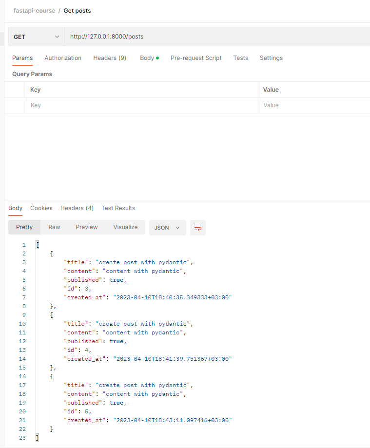
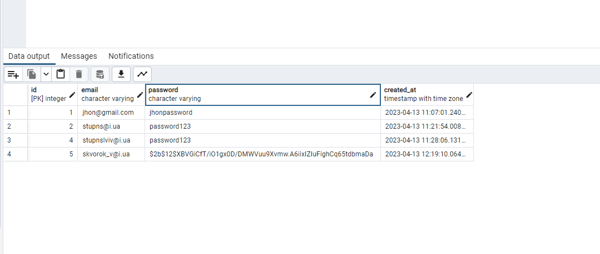

# Alembic

create schemas.py and add code from main:

```python
class PostBase(BaseModel):
    title: str
    content: str
    published: bool = True


class PostCreate(PostBase):
    pass


class PostUpdate(PostBase):
    pass
```

and change for create and update variable func to chemas class:

```python
@app.post('/posts', status_code=status.HTTP_201_CREATED)
def create_posts(post: schemas.PostCreate, db: Session = Depends(get_db)):
    ...

@app.put("/posts/{id}")
def update_post(id: int, update_post: schemas.PostUpdate, db: Session = Depends(get_db)):
    ...

```
____

## How use schemas and what`s doing them

```python
class Post(PostBase):
    id: int
    title: str
    content: str
    published: bool
    created_at: datetime

    class Config:
        orm_mode = True
```

```python
@app.post('/posts', status_code=status.HTTP_201_CREATED, response_model=schemas.Post)
def create_posts(post: schemas.PostCreate, db: Session = Depends(get_db)):
   ...
```


fix duplicate:

```python
class PostBase(BaseModel):
    title: str
    content: str
    published: bool = True


class Post(PostBase):
    id: int
    created_at: datetime

    class Config:
        orm_mode = True

```

and change for next endpoints:
```python

@app.get('/posts', response_model=List[schemas.Post])
def get_posts(db: Session = Depends(get_db)):
   ...

@app.post('/posts', status_code=status.HTTP_201_CREATED, response_model=schemas.Post)
def create_posts(post: schemas.PostCreate, db: Session = Depends(get_db)):
   ...

@app.delete('/posts/{id}', status_code=status.HTTP_204_NO_CONTENT)
def delete_post(id: int, db: Session = Depends(get_db)):
   ...    

@app.put("/posts/{id}", response_model=schemas.Post)
def update_post(id: int, update_post: schemas.PostUpdate, db: Session = Depends(get_db)):
   ...

```
result: 


___
## Create User

```python
# models.py
class User(Base):
    __tablename__ = 'users'

    id = Column(Integer, primary_key=True, nullable=False)
    email = Column(String, nullable=False, unique=True)
    password = Column(String, nullable=False)
    created_at = Column(TIMESTAMP(timezone=True), nullable=False, server_default=text('now()'))

# schemas.py

class UserCreate(BaseModel):
    email: EmailStr
    password: str


class UserOut(BaseModel):
    id: int
    email: EmailStr
    created_at: datetime

    class Config:
        orm_mode = True

# main. py

@app.post('/users', status_code=status.HTTP_201_CREATED, response_model=schemas.UserOut)
def create_user(user: schemas.UserCreate, db: Session = Depends(get_db)):
    new_user = models.User(**user.dict())
    db.add(new_user)
    db.commit()
    db.refresh(new_user)
    return new_user

```

You need install password-hashing:
pip install passlib[bcrypt]

next step add in new utils.py:
```python
from passlib.context import CryptContext


pwd_context = CryptContext(schemes=["bcrypt"], deprecated="auto")


def hash(password: str):
    return pwd_context.hash(password)
```

update function for hash password:

```python
@app.post('/users', status_code=status.HTTP_201_CREATED, response_model=schemas.UserOut)
def create_user(user: schemas.UserCreate, db: Session = Depends(get_db)):
    #hash the password - user.password
    user.password = utils.hash(user.password)
    new_user = models.User(**user.dict())
    db.add(new_user)
    db.commit()
    db.refresh(new_user)
    return new_user
```

result will be below:


## Get user

```python
@app.get('/users/{id}', response_model=schemas.UserOut)
def get_user(id: int, db: Session = Depends(get_db)):
    user = db.query(models.User).filter(models.User.id == id).first()
    if not user:
        raise HTTPException(status_code=status.HTTP_404_NOT_FOUND, detail=f"User with id: {id} does not exist")

    return user
```

