# Start create api and use POSTMAN
___
```python
from fastapi.params import Body

@app.post('/createposts')
def create_posts(payLoad: dict = Body(...)):
    print(payLoad)
    return {'message': 'successfully create posts'}

```
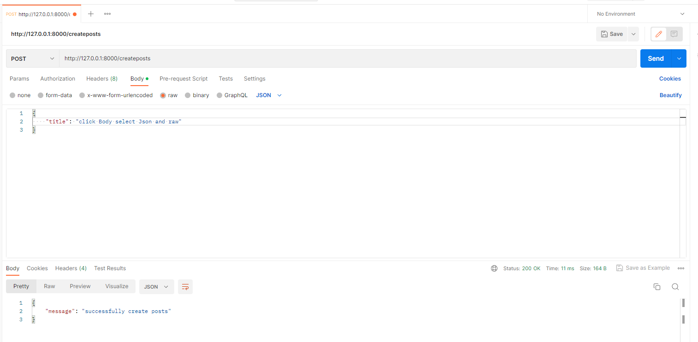

Will be result: 

```text
INFO:     127.0.0.1:56955 - "POST /createposts HTTP/1.1" 200 OK
{'title': 'click Body select Json and raw'}

```

___

### next tips

```python
@app.post('/createposts')
def create_posts(payLoad: dict = Body(...)):
    return {'message': f"title {payLoad['title']} content: {payLoad['content']}"}
```
Will be result if send request:
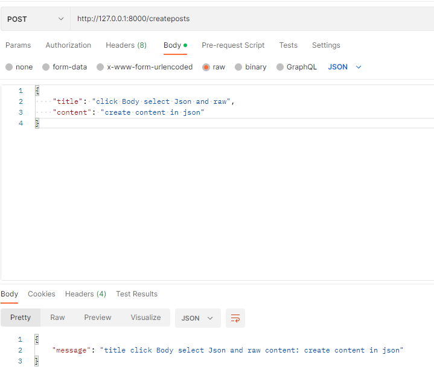

___

### next tips

```python
class Post(BaseModel):  # <-- It need for check validation to types
    title: str
    content: str


@app.post('/createposts')
def create_posts(new_post: Post):
    print(new_post.title)
    return {"data": "new post"}
```
and send in POSTMAN will be next 
```text
INFO:     127.0.0.1:58405 - "POST /createposts HTTP/1.1" 200 OK
click Body select Json and raw
```
___

### next tips
```python
class Post(BaseModel):
    title: str
    content: str
    published: bool = True
    rating: Optional[int] = None


@app.post('/createposts')
def create_posts(new_post: Post):
    print(new_post.title)
    print(new_post.published)
    print(new_post.rating)
    return {"data": "new post"}
```

Result will be:

```text
INFO:     Application startup complete.
click Body select Json and raw
True
None

```

and better view:

```python
@app.post('/createposts')
def create_posts(new_post: Post):
    print(new_post.dict())    
    return {"data": new_post}
```
will be result:

```text
INFO:     Application startup complete.
{'title': 'click Body select Json and raw', 'content': 'create content in json', 'published': True, 'rating': None}

```
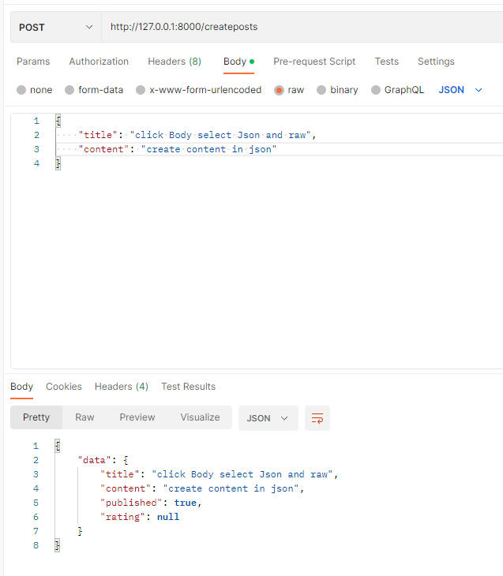

___
# CRUD examples:

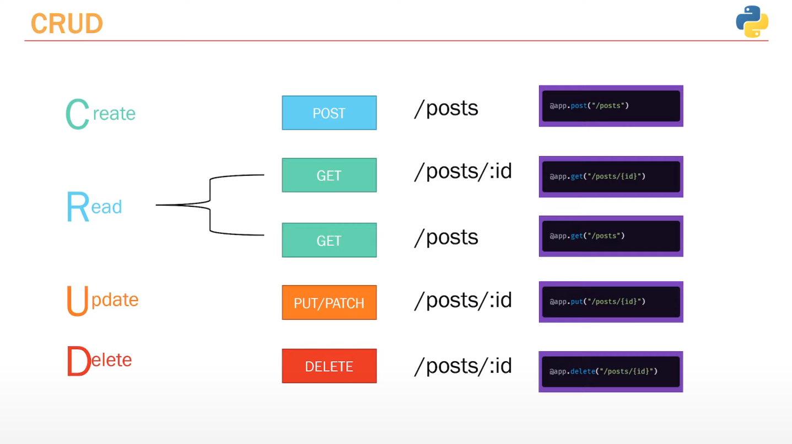

## example:
```python
y_posts = [{"title": "title of post 1", "content": "content of post 1", "id": 1},
            {"title": "favorite pizza", "content": "i like pizza", "id": 2},
            ]


@app.get('/posts')
def get_posts():
    return {"data": my_posts}


@app.post('/posts')
def create_posts(post: Post):
    post_dict = post.dict()
    post_dict['id'] = randrange(0, 5000)
    my_posts.append(post_dict)
    return {"data": post_dict}

```

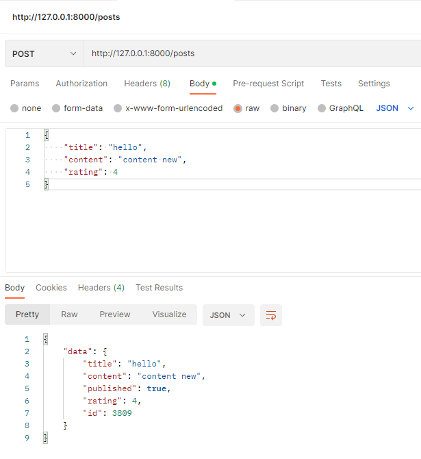

___

## Get post to id

```python
@app.get("/posts/{id}")
def get_post(id):
    print(id)
    return {"post_detail": f"Gere is post {id}"}
```
result below: 

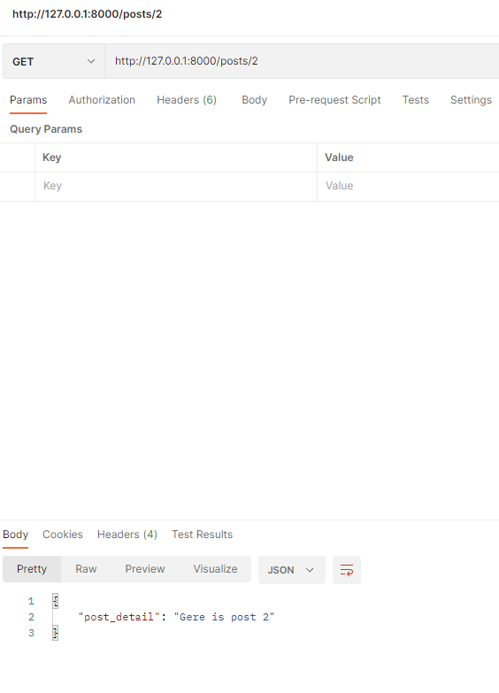

### update func: 

```python
##def find_post(id):  <- bad code
##    for p in my_posts:
##        if p['id'] == id:
##            return p

def find_post(id):
    return [p for p in my_posts if p['id'] == id]
    
def get_post(id: int):
    post = find_post(int(id))
    return {"post_detail": post}
```

### Result: 
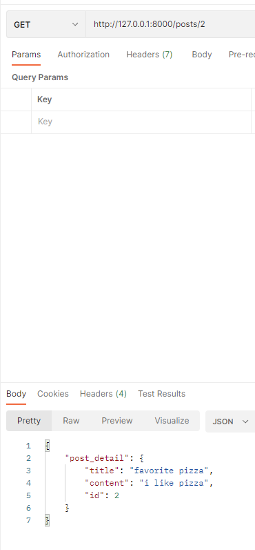

## Demonstration how return last post:

```python
@app.get("/posts/latest")
def get_latest_post():
    post = my_posts[len(my_posts) - 1]
    return {'detail': post}


## func get_latest_post should will be stay before func because get_post wait int(id)
@app.get("/posts/{id}")
def get_post(id: int):
    ...
```

### result: 

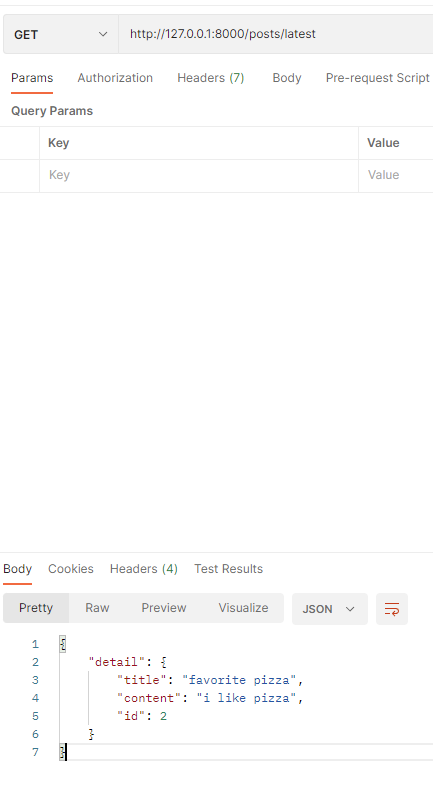

## How send correct information to request if post don`t exist:

```python
@app.get("/posts/{id}")
def get_post(id: int, response: Response):
    post = find_post(int(id))
    if not post:
        response.status_code = status.HTTP_404_NOT_FOUND
        return {'message': f"post with id : {id} was not found"}
    return {"post_detail": post}
```
result will be:

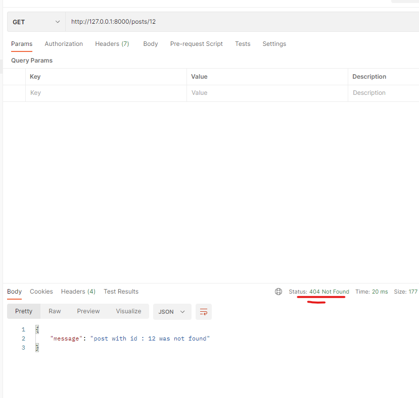

more correctly write code next: 
```python
@app.get("/posts/{id}")
def get_post(id: int):
    post = find_post(int(id))
    if not post:
        raise HTTPException(status_code=status.HTTP_404_NOT_FOUND,
                            detail=f"post with id : {id} was not found")
    return {"post_detail": post}
```

the result will remain the same.

```python
# too should add status code where cteate posts:
@app.post('/posts', status_code=status.HTTP_201_CREATED)
def create_posts(post: Post):
    ...
```

## Delete posts:

```python
def find_index_post(id):
    for i, p in enumerate(my_posts):
        if p['id'] == id:
            return i

@app.delete('/posts/{id}', status_code=status.HTTP_204_NO_CONTENT)
def delete_post():
    index = find_index_post(id)
    my_posts.pop(index)
    return {'message': {'post was successfully deleted'}}

```

result will be: 

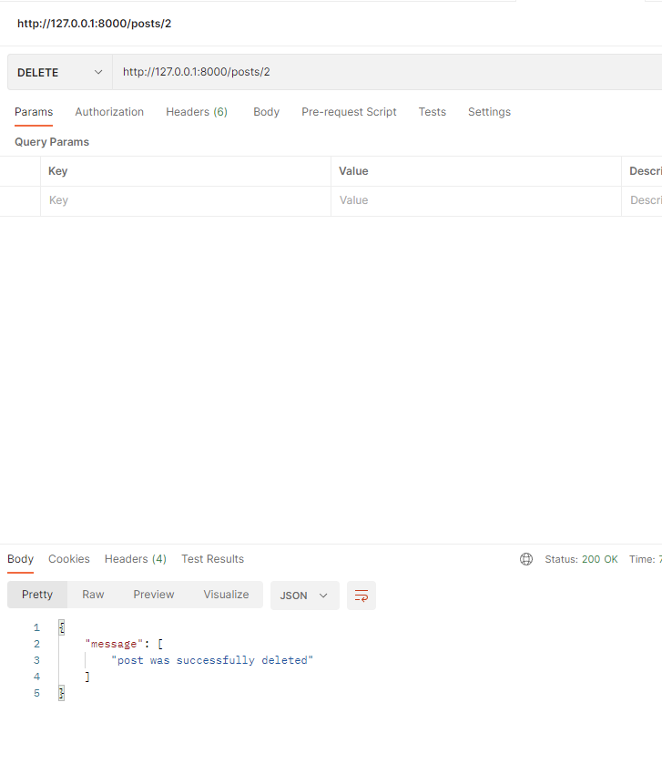

update next code if post don`t exist: 
```python
def delete_post(id: int):
    index = find_index_post(id)
        if index == None:
        raise HTTPException(status_code=status.HTTP_404_NOT_FOUND, detail=f"post with id : {id} does not exist")
    my_posts.pop(index)
    return Response(status_code=status.HTTP_204_NO_CONTENT)
```
result will be: 

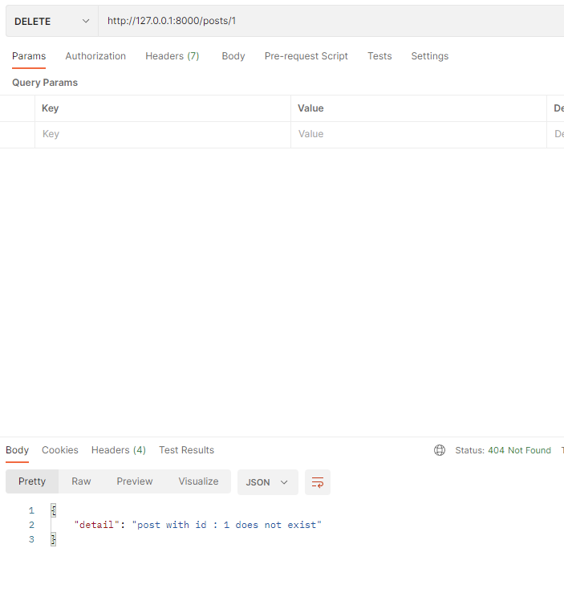

## UPDATE posts:

```python
@app.put("/posts/{id}")
def update_post(id: int, post: Post):
    print(Post)
    return {'message': "update post"}
```

and create in POSTMAN put request and JSON with key:value  correct validation types for class POST, see bellow:

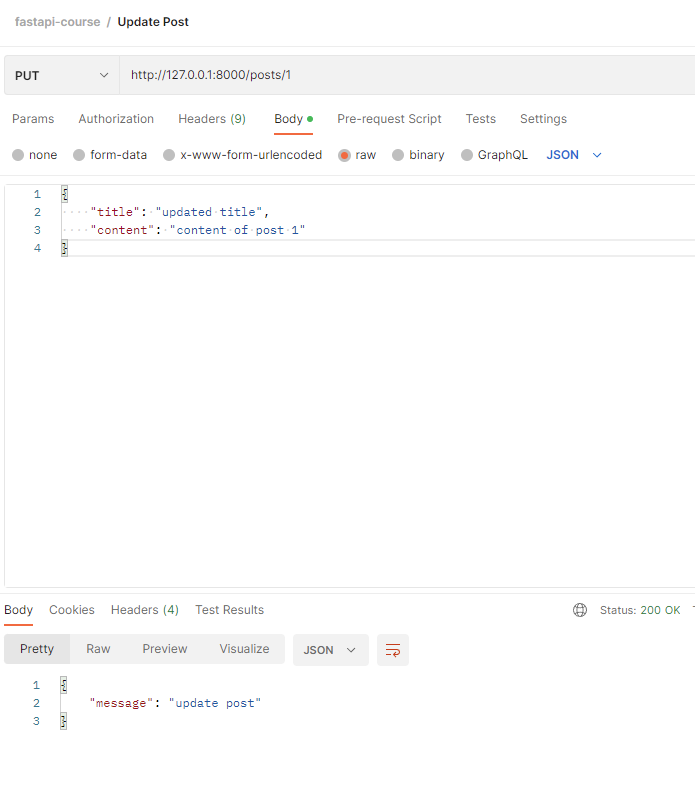

```text
INFO:     Application startup complete.
title='updated title' content='content of post 1' published=True rating=None

```

## Update func that change new updated info for existed post:

```python
@app.put("/posts/{id}")
def update_post(id: int, post: Post):
    index = find_index_post(id)
    if index == None:
        raise HTTPException(status_code=status.HTTP_404_NOT_FOUND, detail=f"post with id : {id} does not exist")
    post_dict = post.dict()
    post_dict['id'] = id
    my_posts[index] = post_dict
    return {'data': post_dict}
```

check POSTMAN:

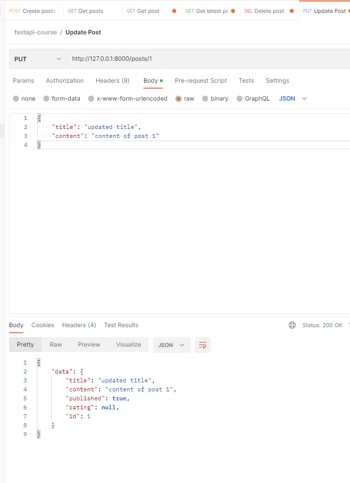

and check get all posts:

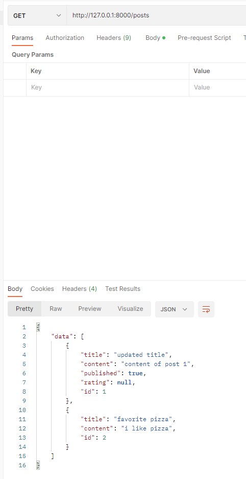

___

## You can use APIrequest without POSTMAN in inext urls:

http://127.0.0.1:8000/docs - check available

http://127.0.0.1:8000/redoc - better view