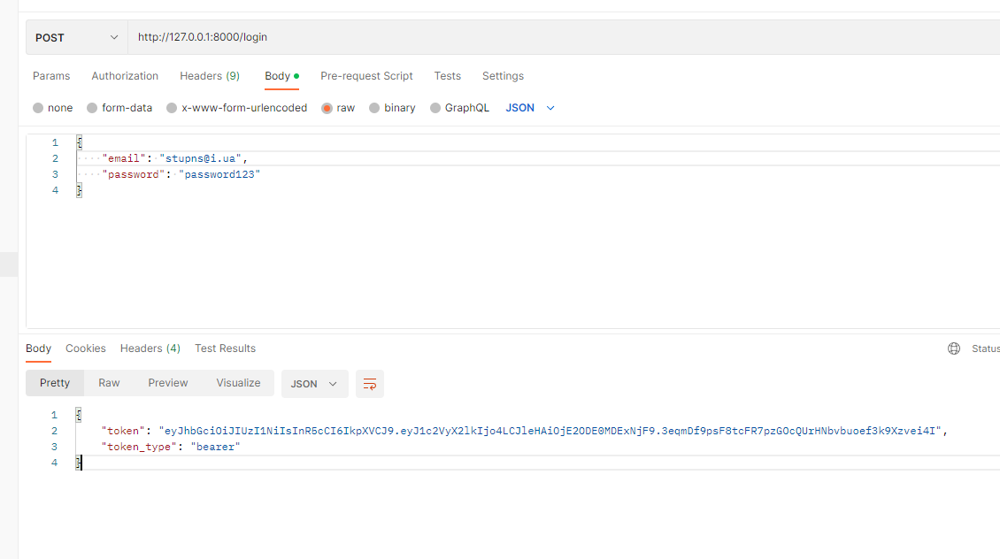

# Create user authentication
___

Create in folder routes next file auth.py:

```python
from fastapi import APIRouter,Depends,status,HTTPException,Response
from sqlalchemy.orm import Session
from .. import database, schemas, models, utils

router = APIRouter(tags=['Authentication'])


@router.post('/login')
def login(user_credentials: schemas.UserLogin, db: Session = Depends(database.get_db)):
    user = db.query(models.User).filter(models.User.email == user_credentials.email).first()

    if not user:
        raise HTTPException(status_code=status.HTTP_404_NOT_FOUND, detail=f"invalid Credentials")

    if not utils.verify(user_credentials.password, user.password):
        raise HTTPException(status_code=status.HTTP_404_NOT_FOUND, detail=f"invalid Credentials")

    # create a token

    return {"token": "example token"}
```

add new func verify() in utils.py:

```python
def verify(plain_password, hashed_password):
    return pwd_context.verify(plain_password, hashed_password)

```
You need install next library:

```commandline
pip install python-jose[cryptography]
```
create file oath2.py with func a generate token:
```python
from jose import JWTError, jwt
from datetime import datetime, timedelta

# SECRET_KEY
# Algorithm
#Expriation time

SECRET_KEY = '09d25e094faa6ca2556c818166b7a9563b93f7099f6f0f4caa6cf63b88e8d3e7'
ALGORITHM = "HS256"
ACCESS_TOKEN_EXPIRE_MINUTES = 30


def create_access_token(data: dict):
    to_encode = data.copy()
    expire = datetime.utcnow() + timedelta(minutes=ACCESS_TOKEN_EXPIRE_MINUTES)
    to_encode.update({"exp": expire})

    encoded_jwt = jwt.encode(to_encode, SECRET_KEY, algorithm=ALGORITHM)
    return encoded_jwt
```



___
## Checking did correct working token in expired time

In first time you need change next code:

```python
@router.post('/login', response_model=schemas.Token)
def login(user_credentials: OAuth2PasswordRequestForm = Depends(), db: Session = Depends(database.get_db)):
    user = db.query(models.User).filter(
        models.User.email == user_credentials.username).first()
    ...
    ...
    ...
    # create a token
    access_token = oauth2.create_access_token(data={"user_id": user.id})
    return {"access_token": access_token, "token_type": "bearer"}
```


create classes for checking validate token in chemas:
```python
class Token(BaseModel):
    access_token: str
    token_type: str


class TokenData(BaseModel):
    id: Optional[str] = None
```

create next func: 
```python
#oath2
oauth2_scheme = OAuth2PasswordBearer(tokenUrl='login')
SECRET_KEY = '09d25e094faa6ca2556c818166b7a9563b93f7099f6f0f4caa6cf63b88e8d3e7'
ALGORITHM = "HS256"
ACCESS_TOKEN_EXPIRE_MINUTES = 60


def create_access_token(data: dict):
    to_encode = data.copy()
    expire = datetime.utcnow() + timedelta(minutes=ACCESS_TOKEN_EXPIRE_MINUTES)
    to_encode.update({"exp": expire})

    encoded_jwt = jwt.encode(to_encode, SECRET_KEY, algorithm=ALGORITHM)
    return encoded_jwt


def verify_access_token(token: str, credentials_exception):
    try:
        payload = jwt.decode(token, SECRET_KEY, algorithms=[ALGORITHM])
        id: str = payload.get("user_id")

        if id is None:
            raise credentials_exception
        token_data = schemas.TokenData(id=id)
    except JWTError:
        raise credentials_exception
    return token_data


def get_current_user(token: str = Depends(oauth2_scheme), db: Session = Depends(database.get_db)):
    credentials_exception = HTTPException(
        status_code=status.HTTP_401_UNAUTHORIZED, detail=f"Could not validate credentials",
        headers={"WWW-Authenticate": "Bearer"})
    token = verify_access_token(token, credentials_exception)
    user = db.query(models.User).filter(models.User.id == token.id).first()
    return user
```

add a check if the user is logged in for create posts:
```python
# posts
@router.post('/', status_code=status.HTTP_201_CREATED, response_model=schemas.Post)
def create_posts(post: schemas.PostCreate, db: Session = Depends(get_db), user_id: int = Depends(oauth2.get_current_user)):
    pass


@router.get("/{id}", response_model=schemas.Post)
def get_post(id: int, db: Session = Depends(get_db),
             current_user: int = Depends(get_current_user)):
    pass


@router.delete('/{id}', status_code=status.HTTP_204_NO_CONTENT)
def delete_post(id: int, db: Session = Depends(get_db),
                current_user: int = Depends(get_current_user)):
    pass


@router.put("/{id}", response_model=schemas.Post)
def update_post(id: int, update_post: schemas.PostUpdate, db: Session = Depends(get_db),
                current_user: int = Depends(get_current_user)):
    pass
```

___

[<-- prev step](1_3_DB_SCHEMAS_README.md)___________________________________________________[next step -->](3_RELATIONSHIPS_MODELS_README.md)