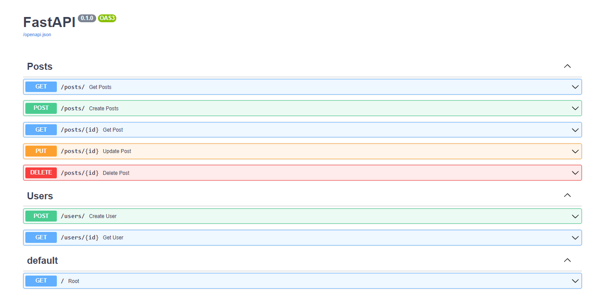

## Refactoring code

Folder routes:
- post.py

```python
from .. import models, schemas
from fastapi import Response, status, HTTPException, Depends, APIRouter
from sqlalchemy.orm import Session
from ..database import get_db
from typing import List

router = APIRouter(
    prefix="/posts"
)


@router.get('/', response_model=List[schemas.Post])
def get_posts(db: Session = Depends(get_db)):
    posts = db.query(models.Post).all()
    return posts


@router.post('/', status_code=status.HTTP_201_CREATED, response_model=schemas.Post)
def create_posts(post: schemas.PostCreate, db: Session = Depends(get_db)):
    # new_post = models.Post(title=post.title, content=post.content, published=post.published)  bellow format if
    # we haw too much variables
    new_post = models.Post(**post.dict())
    db.add(new_post)
    db.commit()
    db.refresh(new_post)
    return new_post


@router.get("/{id}", response_model=schemas.Post)
def get_post(id: int, db: Session = Depends(get_db)):
    post = db.query(models.Post).filter(models.Post.id == id).first()
    if not post:
        raise HTTPException(status_code=status.HTTP_404_NOT_FOUND,
                            detail=f"post with id : {id} was not found")
    return post


@router.delete('/{id}', status_code=status.HTTP_204_NO_CONTENT)
def delete_post(id: int, db: Session = Depends(get_db)):
    post = db.query(models.Post).filter(models.Post.id == id)
    if post.first() == None:
        raise HTTPException(status_code=status.HTTP_404_NOT_FOUND, detail=f"post with id : {id} does not exist")
    post.delete(synchronize_session=False)
    db.commit()
    return Response(status_code=status.HTTP_204_NO_CONTENT)


@router.put("/{id}", response_model=schemas.Post)
def update_post(id: int, update_post: schemas.PostUpdate, db: Session = Depends(get_db)):
    post_query = db.query(models.Post).filter(models.Post.id == id)
    post = post_query.first()

    if post == None:
        raise HTTPException(status_code=status.HTTP_404_NOT_FOUND, detail=f"post with id : {id} does not exist")
    post_query.update(update_post.dict(), synchronize_session=False)
    return post_query.first()


```

- user.py

```python
from .. import models, schemas, utils
from fastapi import status, HTTPException, Depends, APIRouter
from sqlalchemy.orm import Session
from ..database import get_db

router = APIRouter(
    prefix='/users'
)


@router.post('/', status_code=status.HTTP_201_CREATED, response_model=schemas.UserOut)
def create_user(user: schemas.UserCreate, db: Session = Depends(get_db)):
    # hash the password - user.password
    user.password = utils.hash(user.password)
    new_user = models.User(**user.dict())
    db.add(new_user)
    db.commit()
    db.refresh(new_user)
    return new_user


@router.get('/{id}', response_model=schemas.UserOut)
def get_user(id: int, db: Session = Depends(get_db)):
    user = db.query(models.User).filter(models.User.id == id).first()
    if not user:
        raise HTTPException(status_code=status.HTTP_404_NOT_FOUND, detail=f"User with id: {id} does not exist")

    return user


```

main.py

```python
import time

import psycopg2
from fastapi import FastAPI
from psycopg2.extras import RealDictCursor

from . import models
from .database import engine
from .routes import post, user


models.Base.metadata.create_all(bind=engine)
app = FastAPI()


while True:
    try:
        conn = psycopg2.connect(host='localhost', database='db_fast_stupns_api', user='postgres', password='postgres',
                                cursor_factory=RealDictCursor)
        cursor = conn.cursor()
        print("Database connection was successfull!")
        break
    except Exception as error:
        print("Connection to database failed")
        print("Error: ", error)
        time.sleep(2)

my_posts = [{"title": "title of post 1", "content": "content of post 1", "id": 1},
            {"title": "favorite pizza", "content": "i like pizza", "id": 2},
            ]

app.include_router(post.router)
app.include_router(user.router)
```

____
## Add groups for fastapi.docs

```python
### routes/users
router = APIRouter(
    prefix='/users',
    tags=['Users']
)

### routes/posts
router = APIRouter(
    prefix="/posts",
    tags=['Posts']
)
```

http://127.0.0.1:8000/docs#/
